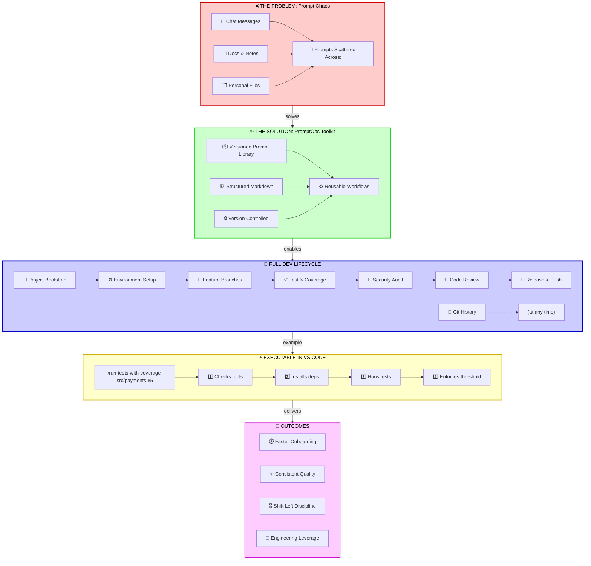

# From Prompt Chaos to Developer Flow: Introducing PromptOps Toolkit for Copilot

Most teams do not lack good AI prompts.  
They lack a way to reuse them without friction.

Your best prompts are probably already written—but buried across chats, docs, and personal notes when you actually need them.

I wanted a better system: versioned, reusable workflows that developers can trigger directly inside VS Code.

So I built **PromptOps Toolkit** — a collection of structured Markdown prompt files that plug into Copilot custom prompts and standardize day-to-day engineering tasks.

> PromptOps Toolkit is a lightweight workflow layer on top of Copilot.

It covers the full development lifecycle:

- Project bootstrapping
- Environment setup
- Feature branch creation
- Test execution with coverage
- Security audits
- Pre-commit code review
- Release notes generation
- Release automation
- Git history exploration

---

**One concrete example (triggered inside VS Code):**

```
/run-tests-with-coverage src/payments 85
```

This triggers a full workflow:

- Checks required tools
- Installs missing dependencies
- Runs tests with coverage
- Enforces thresholds

---



---

## What makes this different from typical prompt libraries

**Executable workflows, not snippets**  
Each prompt includes commands, expected outputs, and usage patterns.

**Adaptive execution, not static prompts**  
Environment-aware, dependency-verifying, and capable of running complete workflows end-to-end.

**Cross-platform team standardization**  
Sync scripts distribute the same prompt set across Windows, macOS, and Linux.

**Release discipline built into the editor**  
Version bump, commit, tag, and push—automated with project-type detection.

---

## Here's the shift this enables

Prompt engineering is useful.  
Prompt operations are scalable.

Think of it as CI/CD for developer workflows.

Most teams scale CI pipelines first.  
Very few scale how developers actually work day-to-day.  
A prompt system shifts that discipline left—into the editor.

I've been using this to standardize workflows across projects—the consistency gains are immediate.

When prompts are treated like code artifacts, teams get:

- Faster onboarding
- Fewer "how do we run this?" interruptions
- More consistent quality and security checks
- Less CI churn from preventable issues

If you are building with Copilot in a team, design your prompt system with:

- Clear parameter schemas
- Pre-flight dependency validation
- Cross-platform sync
- Workflow-level documentation

That is when AI stops being just helpful—and starts becoming engineering leverage.

---

I'm considering open-sourcing PromptOps Toolkit.  
If you've built something similar, I'd love to compare approaches—or learn how your team handles prompt reuse today.

---

`#DeveloperProductivity` `#GitHubCopilot` `#DevEx` `#Automation` `#Testing` `#Security` `#PlatformEngineering`
